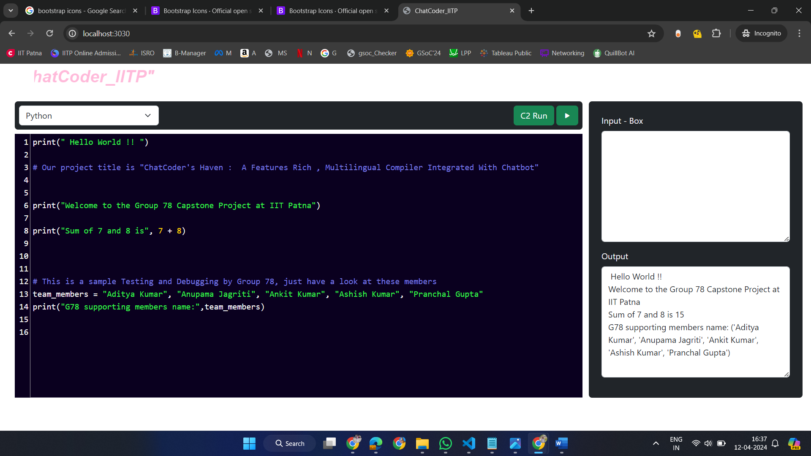

# Hi 👋 all, Myself Ankit         Welcome to my contribution in this project

<!-- our proj featutres -->
## Key Features

- **Multilingual Support:** Code in various programming languages, currently C++, Python, Java, and JavaScript (under testing).
- **Real-time Code Compilation and Execution:** Code, compile, and run code snippets within the platform.
- **Integrated Chatbot:** Developed a chatbot to assist users with coding tasks on the platform.
- **QR Code Sign-in:** Implementing a sign-in feature using QR codes, allowing users to directly login to our portal only if they scan and get connected (Upcoming Feature).
- **Syntax Highlighting:** Code editor with syntax highlighting tailored to each supported language.
- **Auto-closing Brackets and Line Numbering:** Enhanced code readability with automatic bracket closing and line numbering.
- **Dark Theme Option:** Improve user experience with a dark theme option for reduced eye strain.

<!-- screenshots of Hello ChatCoder -->
  

<!-- my jobs to this proj -->
## My Roles and Responsibilities:

### Backend & Databases:

- **Ankit Kumar:** plays crucial and pivotal roles (Compilation, Repo maintenance & Multilingual feature), are: 
  
    - developing the web application, which serves as an online coding platform with multilingual features.
    - compile the programming languages; currently Python, Java, C++ and JavaScript (under testing). 
    - ensures that the coding environment supports syntax highlighting tailored to each programming language.
    - implements auto-closing brackets for tags and displays line numbering on the left side of each new line.
    - provides dark theme option for better visibility and reduced eye strain
    - handles real-time CRUD operations (Create, Read, Update, Delete).
    - contributes to Testing and Debugging part of the code, ensuring a robust application, checking and reviewing the code of each member before pulling (PR) to GitHub.
    - integrates the chatbot into our application but created and developed by Ashish.
    - reviewed and corrected code errors with the support of all members.
    - merged pull requests, reviewed code, and maintained the GitHub repository.

<!-- Note: Have a look at snapshots of project Testing and Debugging parts -->
  

<!-- Backend Testing img -->

  
<!-- for languae testing -->

Now, we have Language successfully compile and screenshots are given below: -  

Java Lang testing and compile code snapshots:

 
Python Code Lang testing and compile snapshots:

 

 
Cpp prog lang compilation screenshot:

